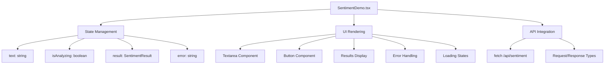

# Design Document

## Overview

The BERT sentiment analysis demo will integrate seamlessly with the existing MLAI-Stack portfolio website, following the established architectural patterns. The implementation consists of a FastAPI backend service that loads a Hugging Face BERT model at startup and exposes a REST API endpoint, paired with a React frontend component that provides an intuitive interface for text sentiment analysis.

The design leverages the existing infrastructure including the Vite proxy configuration, UI component library, error handling patterns, and responsive design system to ensure consistency with other ML demos on the site.

## Architecture

### System Architecture

```mermaid
graph TB
    subgraph "Frontend (React/Vite)"
        A[SentimentDemo Component] --> B[UI Components]
        A --> C[Fetch API Client]
        B --> D[Textarea Input]
        B --> E[Submit Button]
        B --> F[Results Display]
        B --> G[Loading States]
    end
    
    subgraph "Development Proxy"
        H[Vite Dev Server :8080] --> I[Proxy /api/*]
    end
    
    subgraph "Backend (FastAPI)"
        J[FastAPI Server :8000] --> K[/api/sentiment Endpoint]
        K --> L[BERT Pipeline]
        L --> M[DistilBERT Model]
        J --> N[CORS Middleware]
        J --> O[Request Validation]
    end
    
    C --> H
    I --> J
    
    subgraph "Model Loading"
        P[Hugging Face Hub] --> M
        Q[Model Cache] --> M
    end
```

### Component Architecture

The frontend follows the established demo component pattern:



## Components and Interfaces

### Backend Components

#### FastAPI Application Structure
- **Main Application**: FastAPI app with CORS middleware and error handling
- **Model Loading**: Startup event handler that initializes the BERT pipeline
- **Request/Response Models**: Pydantic models for type safety and validation
- **Endpoint Handler**: POST `/api/sentiment` endpoint with comprehensive error handling

#### Model Configuration
- **Model**: `distilbert-base-uncased-finetuned-sst-2-english`
- **Pipeline**: Hugging Face `sentiment-analysis` pipeline
- **Device**: Auto-detection of CUDA/CPU with fallback
- **Optimization**: Return all scores for detailed confidence metrics

### Frontend Components

#### SentimentDemo Component Structure
```typescript
interface SentimentResult {
  label: string;           // 'POSITIVE' | 'NEGATIVE'
  confidence: number;      // 0-1 confidence score
  scores: {               // Individual class scores
    positive: number;
    negative: number;
  };
  processing_time: number; // Processing time in ms
  model_info: {           // Model metadata
    name: string;
    architecture: string;
    device: string;
  };
}

interface SentimentRequest {
  text: string;           // Input text (1-1000 chars)
}
```

#### UI Component Integration
- **Textarea**: Shadcn/ui textarea component with character limit
- **Button**: Gradient accent button matching existing design
- **Results Card**: Consistent with other demo result displays
- **Error Handling**: Using existing error boundary and alert patterns
- **Loading States**: Animated loading indicators matching site design

### API Interface

#### Endpoint Specification
```typescript
POST /api/sentiment
Content-Type: application/json

Request Body:
{
  "text": "I love this product!"
}

Response (200):
{
  "label": "POSITIVE",
  "confidence": 0.9998,
  "scores": {
    "positive": 0.9998,
    "negative": 0.0002
  },
  "processing_time": 45.2,
  "model_info": {
    "name": "distilbert-base-uncased-finetuned-sst-2-english",
    "architecture": "DistilBERT",
    "device": "cpu"
  }
}

Error Response (400/500):
{
  "detail": "Error message"
}
```

## Data Models

### Request Validation
- **Text Length**: 1-1000 characters
- **Content Validation**: Non-empty after trimming
- **Encoding**: UTF-8 text input
- **Sanitization**: Basic text cleaning and truncation

### Response Structure
- **Primary Result**: Label and confidence score
- **Detailed Scores**: Individual class probabilities
- **Metadata**: Processing time and model information
- **Error Handling**: Structured error responses with HTTP status codes

### State Management
```typescript
// Component State
const [text, setText] = useState<string>('');
const [isAnalyzing, setIsAnalyzing] = useState<boolean>(false);
const [result, setResult] = useState<SentimentResult | null>(null);
const [error, setError] = useState<string | null>(null);

// Model Loading State
const [modelLoaded, setModelLoaded] = useState<boolean>(false);
const [modelError, setModelError] = useState<string | null>(null);
```

## Error Handling

### Backend Error Handling
- **Model Loading Errors**: Graceful degradation with detailed error messages
- **Request Validation**: Pydantic validation with clear error responses
- **Processing Errors**: Timeout handling and resource management
- **HTTP Status Codes**: Appropriate status codes (400, 500, 503)

### Frontend Error Handling
- **Network Errors**: Retry logic and offline detection
- **Validation Errors**: Client-side validation with user feedback
- **API Errors**: Error boundary integration and user-friendly messages
- **Loading States**: Progressive loading with timeout handling

### Error Recovery Patterns
```typescript
// Retry Logic
const { retry, isRetrying } = useRetry({
  maxAttempts: 3,
  delay: 1000,
  onRetry: (attempt) => announce(`Retrying analysis, attempt ${attempt}`)
});

// Error Boundary Integration
<ErrorBoundary onError={(error) => {
  console.error('SentimentDemo error:', error);
  announce("Sentiment analysis encountered an error", "assertive");
}}>
  <SentimentDemo />
</ErrorBoundary>
```

## Testing Strategy

### Backend Testing
- **Unit Tests**: Model loading, endpoint functionality, error handling
- **Integration Tests**: Full request/response cycle testing
- **Performance Tests**: Response time and memory usage validation
- **Error Scenario Tests**: Network failures, invalid inputs, model errors

### Frontend Testing
- **Component Tests**: UI interaction and state management
- **Integration Tests**: API communication and error handling
- **Accessibility Tests**: Screen reader compatibility and keyboard navigation
- **Responsive Tests**: Mobile and desktop layout validation

### Test Structure
```typescript
// Backend Tests (pytest)
test_sentiment_endpoint_success()
test_sentiment_endpoint_validation()
test_model_loading_failure()
test_request_timeout()

// Frontend Tests (Vitest)
test_sentiment_demo_rendering()
test_text_input_validation()
test_api_integration()
test_error_handling()
test_accessibility_compliance()
```

### Performance Testing
- **Model Loading Time**: Measure startup performance
- **Inference Speed**: Track processing time per request
- **Memory Usage**: Monitor resource consumption
- **Concurrent Requests**: Test multiple simultaneous analyses

## Integration Points

### Vite Configuration
The existing Vite proxy configuration will automatically route `/api/sentiment` requests to the FastAPI backend:

```typescript
server: {
  proxy: {
    '/api': {
      target: 'http://localhost:8000',
      changeOrigin: true,
      secure: false,
    },
  },
}
```

### Component Integration
The SentimentDemo component will be integrated into the existing demo showcase:

```typescript
// In ModelsSection.tsx or similar
import SentimentDemo from '@/components/demos/SentimentDemo';

// Add to demo cards array
{
  title: "Sentiment Analysis",
  description: "BERT-powered text sentiment classification",
  component: <SentimentDemo />,
  category: "nlp"
}
```

### Styling Integration
The component will use the existing design system:
- **Tailwind Classes**: Consistent spacing, colors, and typography
- **CSS Variables**: Theme colors and gradients
- **Component Library**: Shadcn/ui components for consistency
- **Responsive Design**: Mobile-first approach with breakpoints

### Accessibility Integration
Following existing accessibility patterns:
- **Screen Reader Support**: ARIA labels and announcements
- **Keyboard Navigation**: Full keyboard accessibility
- **Focus Management**: Proper focus handling during loading states
- **Error Announcements**: Accessible error messaging